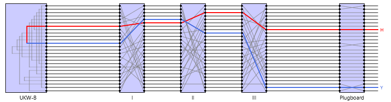

# Enigma Simulator
A Simulation of the Enigma Machine used to encrypt/decrypt messages amongst the German forces during WW2. This is a **Java 20** based project.

In addition to recreating the beauty of the Enigma, this project develops another model in order to improve on the flaws of the original machine which are :
* Self-coding
* Reciprocal coding



## How to run the program
The program can be compiled by using
```
cd enigma_machine_simulator
mvn package
```
### Command Line Interface
You can configure the enigma machine settings by using `config/enigma_settings.xml`

The program can be ran using 
```
cd enigma_machine_simulator
java -cp target/enigma_machine_simulator-1.0.jar com.enigma_machine.launcher.Launcher cli
```
### GUI
The GUI can be ran using
```
cd enigma_machine_simulator
java -cp target/enigma_machine_simulator-1.0.jar com.enigma_machine.launcher.Launcher gui
```

### Creating custom components
`config` contains `rotor_bank.xml` and `reflector_bank.xml`. These files can be used to create custom rotors and reflectors which can be referenced by name in the CLI or GUI. Below shows some examples of custom components.

```
<rotor>
    <name>MyCustomRotor</name>
    <encoding>ZYXWVUTSRQPONMLKJIHGFEDCBA</encoding>
    <turnover_position>E</turnover_position>
</rotor>
```
```
<reflector>
    <name>MyCustomReflector</name>
    <encoding>ZYXWVUTSRQPONMLKJIHGFEDCBA</encoding>
</reflector>
```
**Note** : It is important to define the components correctly, or they will be ignored when parsed

## Included Rotor Configurations
- $I$ Rotor
- $II$ Rotor
- $III$ Rotor
- $IV$ Rotor
- $V$ Rotor

## Included Reflector Configurations
- **UKW-A** Reflector
- **UKW-B** Reflector
- **UKW-C** Reflector

## Acknowledgements
This project utilizes a modified version of `caspian-embedded.css` style sheet from [mkpaz/atlantafx](https://github.com/mkpaz/atlantafx), which is licensed under the MIT License. The original work can be found at the provided link.


